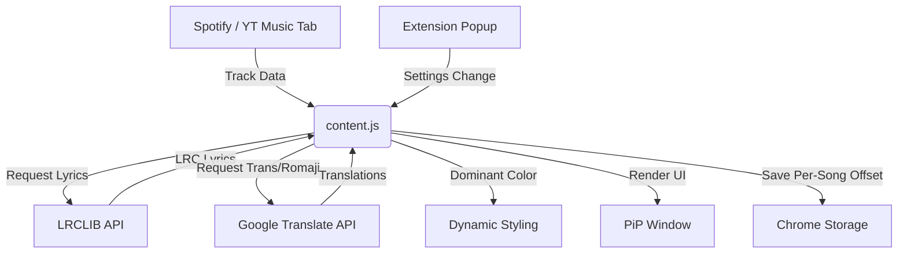

# Flying Romanized Lyrics 🎵

> [!NOTE]
> This extension turns the basic lyrics panel of Spotify and YouTube Music into a beautiful, interactive, and AI-powered experience.

A browser extension that creates a floating **Picture-in-Picture (PiP)** window to show lyrics from Spotify and YouTube Music with AI-powered Romanization and live Translation.

## ✨ Features

### 1. 🎤 Advanced 3-Line Lyrics Engine
Unlike standard lyrics displays, this extension provides a rich 3-line format for multi-lingual listeners:
- **Romaji / Pinyin / Zhuyin**: Automatically generated for Japanese, Korean, and Chinese (CJK) songs. Styled in *Gold/Italic*.
- **Original Lyrics**: The main timestamped lyrics. Styled in **Bold**.
- **Live Translation**: Real-time translation into your language of choice. Powered by Google Translate API.

### 2. 🎨 Dynamic Visuals & Aesthetics
- **Adaptive Coloring**: The extension extracts dominant colors from the current track's album art. Lyrics and accents dynamically change color to match the aesthetic of the song.
- **Glassmorphism UI**: High-fidelity PiP window with modern shadows, gradients, and responsive layouts.
- **Floating PiP Window**: Keep your lyrics visible while browsing other tabs using the Document Picture-in-Picture API.

### 3. 🕹️ Interactive Controls
- **Enhanced Player UI**: Thick, high-visibility SVG controls for Play/Pause, Skip, and Mute.
- **Translation Toggle (CC)**: Quickly toggle translations on/off directly from the PiP window.
- **Mute Control**: Dedicated mute button for convenience.

### 4. ⚙️ Smart Settings & Persistence
- **Customizable Language**: Choose your preferred translation language in the extension popup.
- **Sync Offset Tool**: Adjust lyric timing in ±100ms increments to fix desynced tracks.
- **Song-Specific Memory**: The extension remembers your sync offset adjustments for individual songs, so you don't have to fix the same song twice!

## 🚀 Installation

1.  Download the `Flying Lyrics.zip` from the [Releases](https://github.com/Crlyzd/flying-lyrics/releases) page.
2.  **Extract** the zip file into a permanent folder on your computer.
3.  Open `edge://extensions/` (or `chrome://extensions/`).
4.  Toggle **Developer mode** ON.
5.  Click the **Load unpacked** button.
6.  Select the folder where you just extracted the files (the folder containing `manifest.json`).

## 🛠️ Built With

*   **Core**: Vanilla JavaScript (ES6+), HTML5, CSS3
*   **APIs**:
    *   [Document Picture-in-Picture API](https://developer.chrome.com/docs/web-platform/document-picture-in-picture/) (for the floating window)
    *   [MediaSession API](https://developer.mozilla.org/en-US/docs/Web/API/MediaSession) (for track information)
    *   [LRCLIB API](https://lrclib.net/) (for high-quality synced lyrics)
    *   Google Translate API (for AI Romanization and Translation)

## 📁 Project Structure & Flow

- [content.js](file:///d:/VS/flying-lyrics/flying-lyrics/content.js): The heart of the extension. Handles lyric fetching, translation logic, color extraction, and PiP window management.
- [popup.html](file:///d:/VS/flying-lyrics/flying-lyrics/popup.html) / [popup.js](file:///d:/VS/flying-lyrics/flying-lyrics/popup.js): Settings interface for language selection, visibility toggles, and sync offset adjustments.
- [styles.css](file:///d:/VS/flying-lyrics/flying-lyrics/styles.css): Modern styling for the lyrics display and interactive controls.
- [manifest.json](file:///d:/VS/flying-lyrics/flying-lyrics/manifest.json): Extension configuration and permissions.

## 📝 License
This project is open-source and available under the MIT License.
